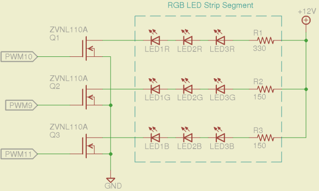
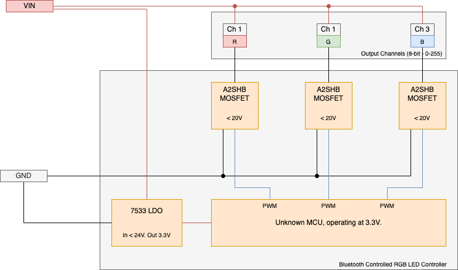

## Hardware

There's very little to be gleaned from opening the device; it's a simple looking PCB with an unmarked 16 pin SMD (SOT552 form factor?) MCU, accompanied by a 24Mhz oscillator. The switching components are N-Channel MOSFETs (A2SHB), and a 7533M is used for voltage regulation (3.3V from a maximum of 24V) for the MCU.

The underside of the PCB contains pads for soldering on connections for both input power and channel output. There's also pads marked "V", "G", and "IR". The PCB is marked with "SN30301533", but I can't find find any reference to this online.

No LEDs or other form of status indicators are present when the device is operational.

### Circuit

The circuit looks like a standard RGB LED control circuit; whereby the MCU controls the target LEDs by means of Pulse Width Modulation (PWM) via the connected MOSFETs.



Here's a simple block diagram showing the components in use:



### Electrical Properties

The circuit has an operating voltage of 3.3-20V. Whilst the LDO can regulate voltages up to 24V, the MOSFETs are only rated to drain up to 20V. (With a current of up to 3.5A)

A generalised interface could allow the bluetooth control of other peripherals that require PWM - i.e. DC motors. 
## Connection

The device advertises itself with the following description:

```
Device Identifier:          BC7FDF7D-62B3-0242-941E-6ACEF4F928A1
Local Name:                 ELK-BLEDOM   
Service UUIDs:              1812  (Human Interface Device - org.bluetooth.service.human_interface_device)
```

Despite advertising the `1812 (HID)` service, this is not a service that the device actually responds to. Attempts at retrieving characteristics associated with this service *will fail*. 

## Communication

The device exposes a Service with a single Characteristic for writing both control and data payloads. Data payloads control things such as brightness or colour, whilst the control payloads can configure timing and basic calendar data.

```
Actual Service UUID:        0000fff0-0000-1000-8000-00805f9b34fb
Actual Characteristic UUID: 0000fff3-0000-1000-8000-00805f9b34fb
```

Attempts at reading this characteristic have proved to be successful, and result in a message of 16 bytes. This will require some further investigation to parse though. `@todo`

### Message Structure

All messages are 72 bits - i.e. 9 bytes, with common initiation and termination bytes - totalling 4 bytes message envelope and 5 containing the message type and parameters.

```
Message Envelope: 4 bytes (32 bits)
Message Content:  5 bytes (40 bits)

byte 1 -> 0x7E (126)   | Initiation Byte
byte 2 -> Optional?    | Seems to work when set to 0x00, but app sets to a unique value per command.
byte 3 -> Command Type |
byte 4 -> Parameter    | Where a parameter is not in use, it appears to be set to
byte 5 -> Parameter    | the value of 255(0xFF) - 11111111. Although using 0x00 seems
byte 6 -> Parameter    | to be acceptable to?
byte 7 -> Parameter    |
byte 8 -> Optional?    | Tends to be set to either 16 or 0; doesn't seem to effect functionality.
byte 9 -> 0xEF (239)   | Termination Byte
```

The Android app differentiates between control messages and data messages - using different device lists as targets. However the generation of those lists appear to be identical, so the intention isn't clear. It's worth noting that there's quite a lot of logic in the app that seems redundant - such as advertising. `@todo`

### Parameter Types

There are 17 different parameters that are used by the associated Android application; their types are listed below. Some of these require further investigation, and some seem to be related to interesting functionality like timed control. `@todo`

```
"wl.extra.bluetoothle.color"                            -> byte[3] = {red, green, blue}
"wl.extra.bluetoothle.brightness"                       -> 0-255
"wl.extra.bluetoothle.light.mode"                       -> 0-255
"wl.extra.bluetoothle.mode.change.speed"                -> ?
"wl.extra.bluetoothle.light.on"                         -> boolean [0|1]
"wl.extra.bluetoothle.color.warm"                       -> 0-100              | Both values should have the
"wl.extra.bluetoothle.color.cold"                       -> 100 - [...warm]    | total of 100.
"wl.extra.bluetoothle.single.color"                     -> 0-100
"wl.extra.bluetoothle.rgbw.on"                          -> ? int: weird bitmask
"wl.extra.bluetoothle.light.mode"                       -> ? int
"wl.extra.bluetoothle.rgb.pin.sequence" ->              -> ?
"wl.extra.bluetoothle.timing.hour.minute.second"        -> int - 3x 8bit values (hour, minute, second)
"wl.extra.bluetoothle.timing.mode"                      -> 0|1
"wl.extra.bluetoothle.timing.weeks"                     -> int - weekday
"wl.extra.bluetoothle.streaming.external.mic.sensitive" -> 0-100
"wl.extra.bluetoothle.streaming.external.mic.on.off"    -> bool
"wl.extra.bluetoothle.streaming.external.mic.eq.mode"   -> 0|1|2|3
```

### Available Commands

There are 15 commands in total that I've managed to find via the app, of which 6 are marked visual: as these control the actual output of the three channels, these are the commands I've focused on implementing. I may implement control ones after investigating their functionality some more. 

```
 # | I | Type    | Description
-----------------------------------------
 1 | Y | Data    | Change Colour
 2 | N | Data    | Music Amplification
 3 | Y | Data    | Change Brightness
 4 | N | Data    | Change Speed
 5 | Y | Data    | Change Colour Temp
 6 | Y | Data    | Change Single Colour
 7 | N | Control | Change BLE Mode
 8 | N | Control | Light On/Off
 9 | N | Control | Change RGBW Mode
10 | N | Control | Change Pin Sequence
11 | N | Control | Set Timing Status
12 | N | Control | Set System Time
13 | N | Control | Streaming External Mic Sensitivity
14 | N | Control | Toggle Streaming
15 | N | Control | Set External Mic Eq Sensitivity
```

`@todo`

#### Data: Changing Colour

description

**Payload:**

```
 Byte | Value
-------------
  1   | 0x7E
  2   | 0x00
  3   | 0x05
  4   | 0x03
  5   | uint8 - RED
  6   | uint8 - GREEN
  7   | uint8 - BLUE
  8   | 0x00
  9   | 0xEF
```

**Reversed Code:**

```
int intExtra = intent.getIntExtra("wl.extra.bluetoothle.color", 0);
visualPayload[0] = 126;
visualPayload[1] = 7;
visualPayload[2] = 5;
visualPayload[3] = 3;
// where intExtra is an Android 'Color' object:
// [8bits: alpha][8bits: red][8bits: green][8bits: blue]
// https://developer.android.com/reference/android/graphics/Color
visualPayload[4] = (byte) ((intExtra >> 16) & 255);
visualPayload[5] = (byte) ((intExtra >> 8) & 255);
visualPayload[6] = (byte) (intExtra & 255);
visualPayload[7] = 16;
visualPayload[8] = -17; // -17 without signing = 239 (0xEF)
```

#### Data: Changing Brightness

description

**Payload:**

```
 Byte | Value
-------------
  1   | 0x7E
  2   | 0x00
  3   | 0x01
  4   | uint8 - brightness
  5   | uint8 - light mode
  6   | 0x00
  7   | 0x00
  8   | 0x00
  9   | 0xEF
```

**Reversed Code:**

```
visualPayload[0] = 126;
visualPayload[1] = 4;
visualPayload[2] = 1;
visualPayload[3] = (byte) intent.getIntExtra("wl.extra.bluetoothle.brightness", 0);
visualPayload[4] = (byte) intent.getIntExtra("wl.extra.bluetoothle.light.mode", 255);
visualPayload[5] = -1;
visualPayload[6] = -1;
visualPayload[7] = 0;
visualPayload[8] = -17; // -17 without signing = 239 (0xEF)
```

#### Data: Changing Colour Temperature

description

**Payload:**

```
 Byte | Value
-------------
  1   | 0x7E
  2   | 0x00
  3   | 0x05
  4   | 0x02
  5   | uint8 - warm | these values must total 100
  6   | uint8 - cold |
  7   | 0x00
  8   | 0x00
  9   | 0xEF
```

**Reversed Code:**

```
visualPayload[0] = 126;
visualPayload[1] = 6;
visualPayload[2] = 5;
visualPayload[3] = 2;
visualPayload[4] = (byte) intent.getIntExtra("wl.extra.bluetoothle.color.warm", 0);
visualPayload[5] = (byte) intent.getIntExtra("wl.extra.bluetoothle.color.cold", 0);
visualPayload[6] = -1;
visualPayload[7] = 16;
visualPayload[8] = -17; // -17 without signing = 239 (0xEF)
```

#### Data: Changing to a Single Colour...?

description

**Payload:**

```
 Byte | Value
-------------
  1   | 0x7E
  2   | 0x00
  3   | 0x05
  4   | 0x01
  5   | uint8 - color
  6   | 0x00
  7   | 0x00
  8   | 0x00
  9   | 0xEF
```

**Reversed Code:**

```
visualPayload[0] = 126;
visualPayload[1] = 5;
visualPayload[2] = 5;
visualPayload[3] = 1;
visualPayload[4] = (byte) intent.getIntExtra("wl.extra.bluetoothle.single.color", 0);
visualPayload[5] = -1;
visualPayload[6] = -1;
visualPayload[7] = 16;
visualPayload[8] = -17; // -17 without signing = 239 (0xEF)
```
